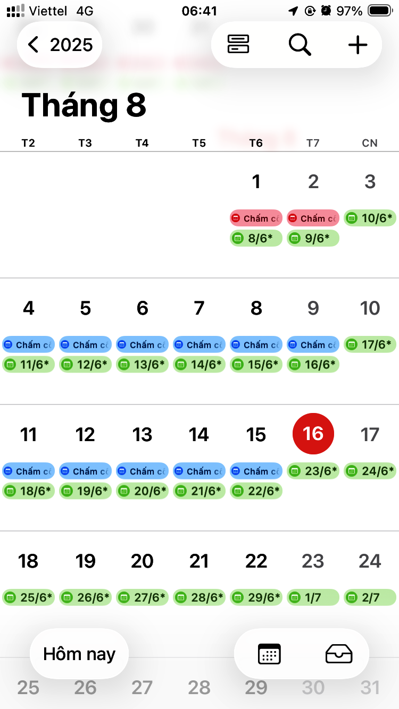
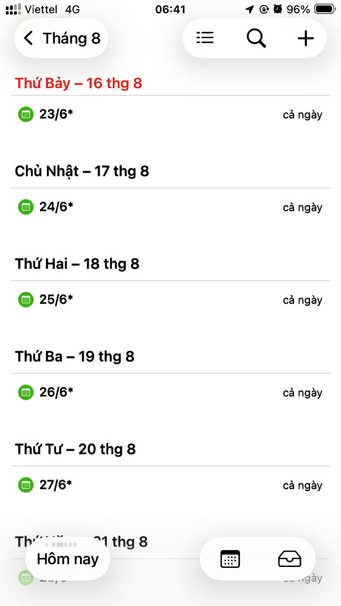
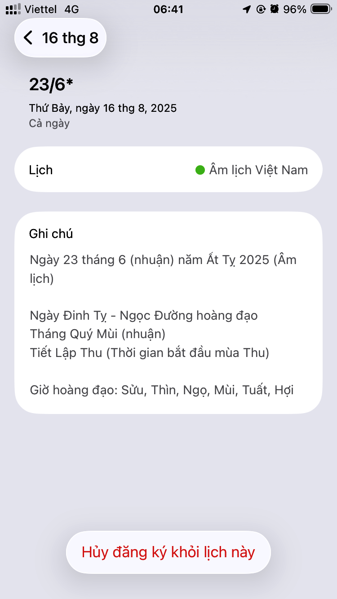
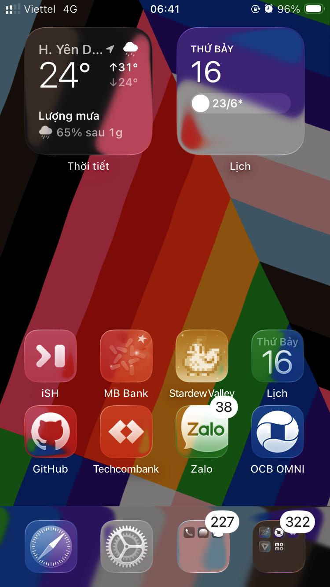

# 🗓️ Âm lịch Việt Nam
_Trình tính âm lịch tự động mã nguồn mở_

## Gì đây?

Sử dụng [Thuật toán tính âm lịch của Hồ Ngọc Đức](https://www.informatik.uni-leipzig.de/~duc/amlich/calrules_v02.html), đây là một chương trình tính âm lịch tự động dưới dạng máy chủ lịch giúp bạn có thể xem âm lịch của ngày tương ứng trực tiếp trong ứng dụng lịch yêu thích của bạn mà không phải tìm kiếm trên Google.






## Làm được những gì?

- Hoạt động hoàn hảo với ứng dụng Lịch trên iPhone
- Xem nhanh ngày - tháng âm lịch trong khoảng trước và sau 1 năm tính từ ngày hiện tại.
- Vẫn có thể xem lịch kể cả khi không kết nối mạng (trước và sau 1 năm kể từ thời điểm ngắt kết nối internet)
- Tự động tính toán Can - Chi của ngày/tháng/năm âm lịch, ngày hoàng đạo, giờ hoàng đạo, tiết khí và bao gồm nó trong phần ghi chú của sự kiện.

## Dùng thế nào?

- Cách 1: Sử dụng liên kết của tôi:
    ```
    https://danamdaya.netlify.app/vi_lunar_calendar
    ```  
    Đăng ký theo dõi máy chủ lịch theo đường dẫn trên bằng ứng dụng lịch yêu thích của bạn và thưởng thức (liên hệ tôi qua danamdaya@gmail.com để được cấp quyền hạn).  

- Cách 2: Sử dụng mã nguồn và tự tạo máy chủ lịch của riêng bạn:
    1. Truy cập [Github](https://github.com/), tạo tài khoản và tạo [Github Pages](https://pages.github.com/) của bạn.
    2. Đẩy [index.mjs](https://github.com/danamdaya/danamdaya.github.io/blob/main/netlify/functions/vi_lunar_calendar/index.mjs), [netlify.toml](https://github.com/danamdaya/danamdaya.github.io/blob/main/netlify.toml) và [package.json](https://github.com/danamdaya/danamdaya.github.io/blob/main/package.json) lên kho lưu trữ bạn vừa tạo được theo cấu trúc
        ```
        /
        ├── netlify
        │   └── functions
        │       └── vi_lunar_calendar
        │           └── index.mjs
        ├── netlify.toml
        └── package.json
        ```
    3. Truy cập [Netlify](https://www.netlify.com/) và tạo tài khoản Netlify của bạn.
    4. Liên kết tài khoản Netlify bạn vừa tạo với kho lưu trữ Github của bạn (truy cập [https://docs.netlify.com/start/quickstarts/deploy-from-template/#step-1-deploy-a-preview-of-your-template-project](https://docs.netlify.com/start/quickstarts/deploy-from-template/#step-1-deploy-a-preview-of-your-template-project) để biết thêm chi tiết).
    5. Tự cấp quyền hạn truy cập cho bản thân dưới dạng biến môi trường Netlify ENV với Key là tên tài khoản và Value là mật khẩu (chi tiết truy cập [https://docs.netlify.com/build/environment-variables/get-started/#site-environment-variables](https://docs.netlify.com/build/environment-variables/get-started/#site-environment-variables)).
    6. Bây giờ tên miền cho máy chủ lịch của bạn sẽ có dạng `https://YOURPROJECT.netlify.app/vi_lunar_calendar`. Đăng ký theo dõi máy chủ lịch mà bạn vừa tạo bằng ứng dụng lịch yêu thích của bạn và thưởng thức.

## Hoạt động ra sao?

Chương trình sử dụng [Netlify Functions](https://docs.netlify.com/build/functions/overview/) - là một hàm không máy chủ chứa [thuật toán tính lịch âm của Hồ Ngọc Đức](https://www.informatik.uni-leipzig.de/~duc/amlich/calrules_v02.html) sẽ được chạy và trả về một tệp iCalendar chứa các sự kiện được đặt tên theo ngày/tháng âm lịch đã tính toán được trong khoảng trước và sau 1 năm từ thời điểm được truy vấn. Hàm dùng [Response Streaming](https://docs.netlify.com/build/functions/get-started/?fn-language=js#synchronous-function) - luồng phản hồi sẽ trả về kết quả ngay lập tức khi vừa tính toán được.  
  
